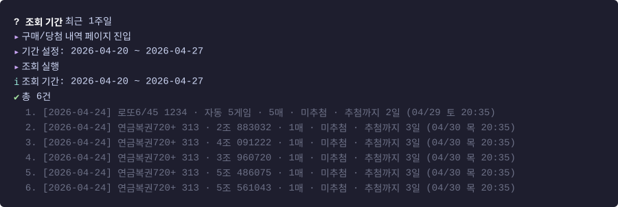
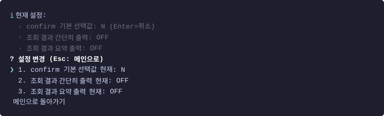

# lottery-cli

동행복권 자동 구매 및 결과 조회 CLI

## 설치

```bash
pnpm install
cp .env.example .env
# .env 에 DHL_USER_ID / DHL_USER_PW 입력
```

## 실행

```bash
pnpm start
```

## 환경 변수

| 이름 | 필수 | 기본값 | 설명 |
|---|---|---|---|
| `DHL_USER_ID` | ✅ | - | 동행복권 아이디 |
| `DHL_USER_PW` | ✅ | - | 동행복권 비밀번호 |
| `HEADLESS` | | `false` | `true`면 브라우저 창 안 뜸 |
| `SLOW_MO_MS` | | `0` | 각 동작 사이 딜레이 (디버깅용) |

## 사용 예시

### 메인 메뉴


### 복권 구매


### 구매내역 / 당첨 결과 조회



### 설정



설정값은 프로젝트 디렉터리의 `.lottery-auto/settings.json` 에 저장되며 다음 실행에도 유지됨.

| 옵션 | 기본 | 설명 |
|---|---|---|
| `defaultConfirmYes` | `false` | 결제 confirm prompt 의 Enter 기본값. `true` 면 Enter = Y |
| `briefHistory` | `false` | 내역 조회 시 번호/조/수량 등 베팅 상세 숨기고 추첨일·종류·회차·결과·당첨금만 출력 |
| `summarizeHistory` | `false` | 내역 조회 결과 뒤에 종류별/결과별/총 구매·당첨·손익 요약 블록 추가 출력 |

## 테스트 스크립트 (DRY_RUN)

결제 직전까지만 검증:

```bash
pnpm test:login               # 로그인 검증
pnpm test:lotto auto 3        # 자동 3게임
pnpm test:lotto manual 2      # 수동 2게임
pnpm test:pension auto 1      # 연금복권 자동
pnpm test:pension manual 1    # 연금복권 수동
pnpm test:history             # 최근 1개월 구매내역
```

## 주의사항

- 개인 사용 목적. 동행복권 이용약관상 자동화 도구는 비공식.
- 로그인 시 CAPTCHA가 뜨면 `HEADLESS=false`로 실행 후 수동 입력.
- 예치금 충전은 https://www.dhlottery.co.kr 에서 수동으로.
- 사이트 리뉴얼로 셀렉터가 깨질 수 있음.
